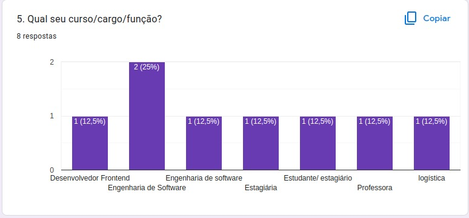
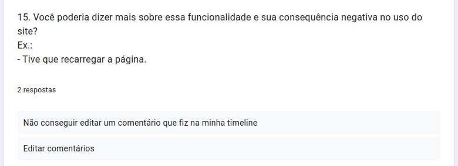

# Perfil do Usuário 

## Introdução

Parte importante do desenvolvimento do projeto é definir um perfil do usuário, sendo assim possível  entender mais sobre os usuários que utilizam o sistema, deve-se ressaltar diversas características tais como: interesse, experiência, faixa etária, conhecimento prévio etc.

## Metodologia

Para a primeira técnicas foi elaborado um questionário no Google Forms de 15 questões a respeito dos usuaŕios, incluindo questões demográficas e relacionadas com o uso do ste, além disso foi elaborado o Termo de Consentimento Livre e Esclarecido, de acordo com a Resolução Nº 466 de 12 de Dezembro de 2012, que está detalhado no artefato dos aspectos éticos, assim como a solicitação opcional do endereço de email do participante para conferir os resultados da pesquisa. O questionário foi divulgado em duas comunidades voltadas para leitores/escritores e afins, foi coletado as respostas dos participantes do questionário durante os dias 01/12 até 03/12.

 

<iframe src="https://docs.google.com/forms/d/e/1FAIpQLSdCCFMUF2burscfOIs-cTl0IIIQgt8_OC1VdRqNkvx6uRNQew/viewform?embedded=true" width="640" height="380" frameborder="0" marginheight="0" marginwidth="0">Carregando…</iframe>

## Resultados do questionário

 
Em relação às perguntas temos que na primeira pergunta ***1 - Qual sua idade***, temos os resultados na representação gráfica presente na <i>Figura 1</i>. Podemos notar que, cerca de 63% da amostra tem entre 18 a 25 anos e 31,8% dos participantes têm entre 26 e 34 anos.

<figcaption align='center'>
 <h6> <b>Figura 1 – Gráfico com o percentual de respostas da questão 1</b> 
  Fonte: Retirada da página de resultados do Google Forms</h6>
</figcaption>

 

Na segunda pergunta ***2 - Qual seu nível de escolaridade?*** Metade dos participantes têm o  Ensino Superior incompleto, como mostra a  <i>Figura 2</i>.

<figcaption align='center'>
 <h6> <b>Figura 2 – Gráfico com o percentual de respostas da questão 2</b> 
  Fonte: Retirada da página de resultados do Google Forms</h6>
</figcaption>

 
Agora na <i>Figura 3</i> temos ***3 - Como qual gênero você se identifica?** Que mostra que 72, 7% dos participantes marcaram a opção feminino no questionário.

<figcaption align='center'>
 <h6> <b>Figura 3 – Gráfico com o percentual de respostas da questão 3</b> 
  Fonte: Retirada da página de resultados do Google Forms</h6>
</figcaption>
 

A quarta pergunta : ***4 - Qual sua ocupação?*** Metade dos participantes são estudantes. enquanto 34,6% estão empregados.<i>(Figura 4)</i>

<figcaption align='center'>
 <h6> <b>Figura 4 – Gráfico com o percentual de respostas da questão 4</b> 
  Fonte: Retirada da página de resultados do Google Forms</h6>
</figcaption>
 
Já na quinta pergunta do questionário, onde foi perguntado: ***5. Qual seu curso/cargo/função?*** Temos os resultados mostrados na <i>Figura 5</i>. Vale ressaltar que esta questão era opcional.

<figcaption align='center'>
 <h6> <b>Figura 5 – Gráfico com o percentual de respostas da questão 5</b> 
  Fonte: Retirada da página de resultados do Google Forms</h6>
</figcaption>
 
Questão seis do questionário ***6. Qual é o seu nível de afinidade com tecnologia?***, maioria dos participantes marcaram a opção que se adapta e utiliza sistemas na medida
do possível, como é ilustrado na <i>Figura 6</i>.

<figcaption align='center'>
 <h6> <b>Figura 6 – Gráfico com o percentual de respostas da questão 6</b> 
  Fonte: Retirada da página de resultados do Google Forms</h6>
</figcaption>
 
Agora na <i>Figura 7</i> temos ***7. Como você conheceu o Skoob?*** As respostas dos participantes ficaram bem distribuídas como mostrado na figura.

<figcaption align='center'>
 <h6> <b>Figura 7 – Gráfico com o percentual de respostas da questão 7</b> 
  Fonte: Retirada da página de resultados do Google Forms</h6>
</figcaption>
 
A oitava pergunta : ***8 - Com que frequência você utiliza o Skoob?*** Maioria dos participantes do questionário cerca de 86% utilizam o site esporadicamente.<i>(Figura 8)</i>

<figcaption align='center'>
 <h6> <b>Figura 8 – Gráfico com o percentual de respostas da questão 8</b> 
  Fonte: Retirada da página de resultados do Google Forms</h6>
</figcaption>

 

Na nona pergunta ***9. Qual é o principal aparelho eletrônico que você utiliza para acessar o Skoob?*** 45,5% dos participantes utilizam o site pelo celular, enquanto também 45,5% utilizam computadores portáteis. <i>Figura 9</i>.

<figcaption align='center'>
 <h6> <b>Figura 9 – Gráfico com o percentual de respostas da questão 9</b> 
  Fonte: Retirada da página de resultados do Google Forms</h6>
</figcaption>

Para a décima pergunta temos ***10 - Você gostaria que o Skoob oferecesse algum tutorial de como utilizar o site?*** A maioria dos participantes gostariam de tutoriais visuais como é ilustrado na <i>Figura 10</i>.

<figcaption align='center'>
 <h6> <b>Figura 10 – Gráfico com o percentual de respostas da questão 10</b> 
  Fonte: Retirada da página de resultados do Google Forms</h6>
</figcaption>

Agora como mostrado na <i>Figura 11</i> a questão ***11 - Você gosta de explorar todas as funcionalidades que o Skoob oferece? Ou costuma usar sempre as mesmas?***, 77.3% dos usuários não exploram as funcionalidades o Skoob, costumam utilizar sempre as mesmas.

<figcaption align='center'>
 <h6> <b>Figura 11 – Gráfico com o percentual de respostas da questão 11</b> 
  Fonte: Retirada da página de resultados do Google Forms</h6>
</figcaption>

 

Para a questão 12 onde se solicitado do participante ***12 - Qual é a funcionalidade do site que você mais utiliza?***, segue algumas das respostas, como é mostrado na <i>Figrura 12 </i>.

<figcaption align='center'>
 <h6> <b>Figura 12 – Lista das respostas da questão 12</b> 
  Fonte: Retirada da página de resultados do Google Forms</h6>
</figcaption>

 

Para a décima terceira pergunta ***O quanto você julga que tem domínio sobre as funcionalidades que o site oferece?*** A maioria dos participantes dizem que têm pouco domínio sobre as funcionalidades que o site oferece (<i>Figura 13</i>).

<figcaption align='center'>
 <h6> <b>Figura 13 – Gráfico com o percentual de respostas da questão 13</b> 
  Fonte: Retirada da página de resultados do Google Forms</h6>
</figcaption>

 

Na penúltima e última questão que são perguntas conectadas, temos ***14 - Durante a utilização do site você já "clicou errado" em alguma função que trouxe algum prejuízo para você?***(<i>Figura 14</i>).Se o participante responder que que "Não" o questionário termina e ele já pode enviar sua contribuição, porém se ele responder que "Sim" ele segue para a questão ***15 - Você poderia dizer mais sobre essa funcionalidade e sua consequência negativa no uso do site?***(<i>Figura 15</i>), onde o participante pode detalhar como foi essa interação que o levou ao erro.

<figcaption align='center'>
 <h6> <b>Figura 14 – Gráfico com o percentual de respostas da questão 14</b> 
  Fonte: Retirada da página de resultados do Google Forms</h6>
</figcaption>

<figcaption align='center'>
 <h6> <b>Figura 15 – Algumas das respostas da questão 15</b> 
  Fonte: Retirada da página de resultados do Google Forms</h6>
</figcaption>

## Conclusão

Levando em conta os dados coletados a partir do formulário, podemos concluir que o nosso perfil do usuário se baseia principalmente em mulheres da faixa etária dos 18 aos 34 anos, onde cerca de metade têm pouco domínio em realização a utilizar o sistema e se adaptam e utilizam sistemas na medida do possível. Umas das tarefas principais que é utilizada é acompanhar sua "estante virtual" e interação com amigos da rede social.

## Referências

> BARBOSA, Simone; SILVA, INTERAÇÃO HUMANO-COMPUTADOR. Local de publicação: Elsevier Editora Ltda, 2010. 

> Resolução CNS nº 466/2012. <https://bvsms.saude.gov.br/bvs/saudelegis/cns/2013/res0466_12_12_2012.html> acesso feito em 27 de novembro de 2022.

## Histórico de versão
| Versão | Data | Descrição | Autor | Revisor |
| :----: | :--: | :-------: | :---: | :-----: |
| 1.0 | 03/12/2022 | Inicialização da página de perfil de usuário | Philipe | --|